# Sentence Classifier using DistilBERT sentence transformers on the 20 Newsgroups dataset from scikit-learn
_Author: Antoine DELPLACE_  
_Last update: 19/07/2020_

This repository contains a REST API that predicts the output classification of a sentence among the 20 possible classes of the Newsgroups dataset from scikit-learn.

## Usage
### File Requirements
Two models need to be added to the folder in order for the API to work :
- `model.zip` which contains the fine-tuned SBERT
- `clf.joblib` which contains the trained classifier

### With Docker
To build the docker image :
> docker build -t docker-api -f Dockerfile .

To run the API :
> docker run -it -p 5000:5000 docker-api python3 api.py

To launch a POST request :
> curl -i -H "Content-type: application/json" -X POST -d '{"input_sentence": "Here is the sentence to classify."}' 127.0.0.1:5000/predict

### File description
1. `Dockerfile` enables docker to build the image

2. `requirements.txt` contains the python library dependancies necessary for the API to run.

3. `api.py` is the file launching the api application.

## Model description

### General idea
1. SBERT is used to create embeddings for sentences. This model is fine-tuned with the 20 Newsgroups training dataset to take into account the true class of each input. The optimizer uses a triplet loss to train the network.
2. An Approximate Nearest Neighbour classifier (using Ball-tree) is used to predict the class of new unseen input thanks to the nearest neighbour.

### Hyperparameters
- num_epochs = 1
- warmup_steps = 120 (around 10% of the total number of steps)
- batch_size = 16
- leaf_size = 30
- n_neighbours = 1

### Possible improvements
- Reduce the number of channels for the embeddings
- Use true distances instead of ball-tree approximation
- Increase the size of the training dataset
- Seperate inputs into array of sentences

## Benchmark

| Models                                        | train_f1_score | test_f1_score |
|-----------------------------------------------|----------------|---------------|
| sBERT                                         | 0.976          | 0.454         |
| fine-tuned with naive triplets                | 0.973          | 0.591         |
| fine-tuned with naive triplets (5 neighbours) | 0.730          | 0.566         |
| fine-tuned with hard triplets (euclidean)     | 0.975          | 0.549         |
| fine-tuned with hard triplets (cosine)        | 0.976          | 0.571         |
| fine-tuned with semi hard triplets            | 0.973          | 0.587         |
| fine-tuned with mix triplets (euclidean)      | 0.975          | 0.608         |
| fine-tuned with mix triplets (cosine)         | 0.977          | 0.609         |
| long fine-tunes with mix triplets (cosine)    | 0.976          | __0.614__     |
| two steps training with misclassified triplet | 0.977          | 0.605         |
| TF-IDF + multinomial Naive Bayes              | 0.961          | 0.683         |

## Visualization
| Models                   | PCA                              | t-SNE                            |
:-------------------------:|:--------------------------------:|:---------------------------------:
sBERT                      |  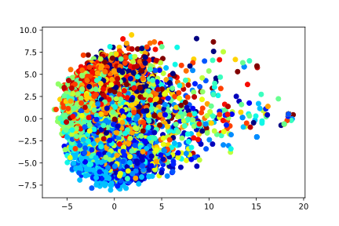    |  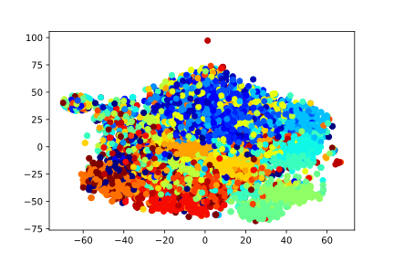
naive triplets             |  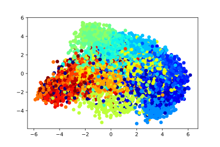    |  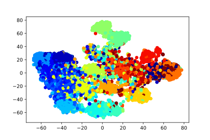
hard triplets (euclidean)  |     |  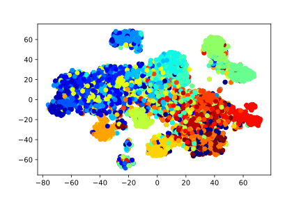
hard triplets (cosine)     |  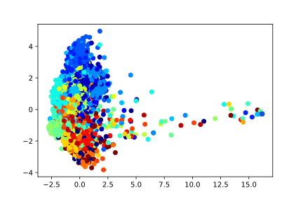   |  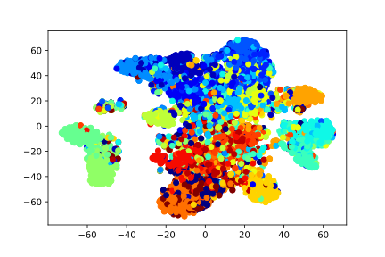
mix triplets (cosine)      |  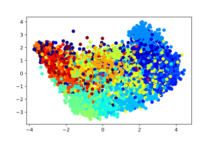      |  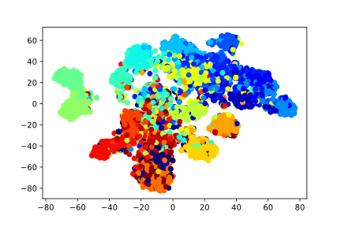
long mix triplets (cosine) |  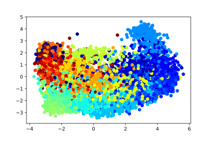 |  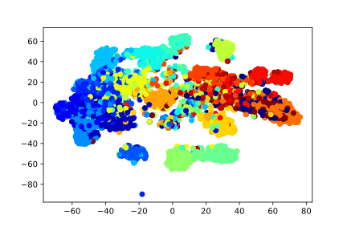

## References
1. Scikit-learn developers "The 20 newsgroups text dataset", _scikit-learn_, 2007-2019. [scikit-learn.org](https://scikit-learn.org/stable/datasets/index.html#the-20-newsgroups-text-dataset)
2. N. Reimers and I. Gurevych (UKP-TUDA): Sentence Embeddings using Siamese BERT-Networks, _Proceedings of the 2019 Conference on Empirical Methods in Natural Language Processing_, 2019. [arXiv:1908.10084](https://arxiv.org/abs/1908.10084)